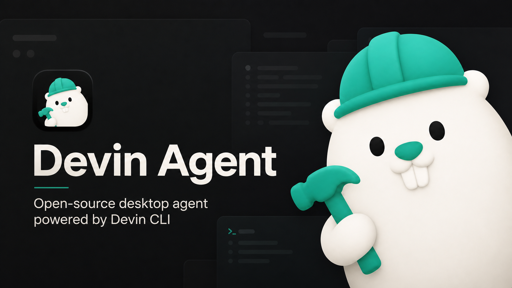
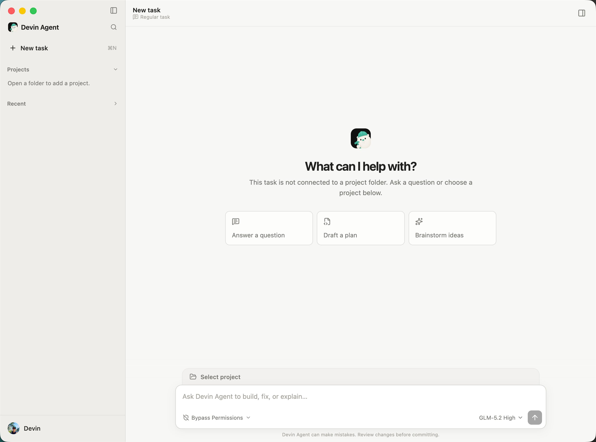

<p align="center">
  
</p>

<h1 align="center">Devin Coding Agent</h1>

<p align="center">A desktop coding agent powered by your locally installed Devin CLI.</p>

<p align="center">
  <strong>English</strong> · <a href="README.zh-CN.md">简体中文</a>
</p>

---

Devin Coding Agent is a native desktop client that connects to the Devin CLI via the
[Agent Client Protocol (ACP)](https://docs.devin.ai/cli/). It does not bundle or redistribute
the Devin CLI binary — you install and authenticate the CLI yourself, and the app drives it
through ACP.

## Preview

<p align="center">
  
</p>

## Download

Download the latest macOS and Linux installers from the project's
[GitHub Releases page](https://github.com/zaleGZL/devin-agent/releases). Choose `arm64` for an
Apple Silicon Mac or `x64` for an Intel Mac. The installers are currently unsigned; macOS
installation instructions are included below.

## Features

- Workspace management with multiple Devin sessions
- Streaming conversations with reasoning, plans, and tool activity
- Image input, dynamic models and modes, permission requests
- `@` references for project files, directories, and cached global/project Skills
- File preview, themes, language switching, and command palette
- Optional WeChat Bot bridge with QR login, a fixed Devin session, durable message queues, and tray controls
- Capabilities are negotiated at runtime from the ACP — nothing is hardcoded

### Composer `@` references

Type `@` in the composer to reference **Files**, **Directories**, or **Skills**.

## Prerequisites

- [Node.js](https://nodejs.org/) `>= 22.19.0`
- A current [pnpm](https://pnpm.io/) release; the repository does not pin a pnpm version
- [Devin CLI](https://docs.devin.ai/cli/) installed and authenticated (`devin auth login`)

Activate Node.js `>= 22.19.0` before invoking pnpm. The repository uses the pnpm executable
from your environment instead of selecting or enforcing a package-manager version.

## Quick start

```bash
git clone https://github.com/zaleGZL/devin-agent.git
cd devin-agent
pnpm install
pnpm dev
```

If the app cannot find `devin` on your `PATH`, open **Settings** and select the absolute path
to the Devin CLI binary. The app runs `devin --version` to verify, then connects via `devin acp`.

## Development

```bash
pnpm check              # typecheck + lint + test + build
pnpm check:independence # ensure no forbidden DSCode references
pnpm test               # unit tests only
```

Real ACP smoke test (requires an authenticated Devin CLI):

```bash
DEVIN_LIVE_TEST=1 pnpm --dir apps/desktop smoke:devin
```

## Build & package

```bash
pnpm build              # build electron + renderer
pnpm pack               # local unsigned pack
pnpm pack:mac           # build an unsigned Apple Silicon DMG, copy it to Downloads, and open Finder
```

## Release

1. Bump `version` in `apps/desktop/package.json`.
2. Commit.
3. Run `pnpm publish:desktop` — this tags `desktop-v<version>`, pushes it, and CI builds
   and publishes installers to GitHub Releases.

Installers are currently **unsigned and not notarized**. Windows will show a SmartScreen
warning. Follow the steps below for macOS.

### Install an unsigned macOS build

Gatekeeper may report that the developer cannot be verified or that Apple cannot check the
app for malicious software. Only bypass these warnings for a DMG downloaded from this
project's [official GitHub Releases](https://github.com/zaleGZL/devin-agent/releases).

1. Download the correct DMG (`arm64` for Apple Silicon or `x64` for Intel), open it, and drag
   **Devin Agent** into **Applications**.
2. Try to open the installed app once. Then open **System Settings → Privacy & Security**,
   scroll to **Security**, click **Open Anyway**, authenticate, and confirm **Open**. See
   [Apple's Gatekeeper instructions](https://support.apple.com/en-us/102445).
3. If a verified download is still reported as damaged or cannot be opened, remove the
   quarantine attribute from this app only, then launch it:

   ```bash
   xattr -dr com.apple.quarantine "/Applications/Devin Agent.app"
   open "/Applications/Devin Agent.app"
   ```

   If the first command reports a permission error, run that command again with `sudo`.

Do not disable Gatekeeper globally. Removing quarantine bypasses a macOS security check, so
verify the download source before running the command.

## Platform notes

| Platform | Sandbox | Notes |
|----------|---------|-------|
| macOS | Seatbelt | Full sandbox support |
| Linux | `bubblewrap` + `socat` | Required dependencies for sandbox |
| Windows | Not available | Devin CLI does not support OS sandbox on Windows |

When sandbox is requested but the environment does not support it, the app fails closed
and never silently falls back to unisolated execution.

## License

[MIT](LICENSE)
